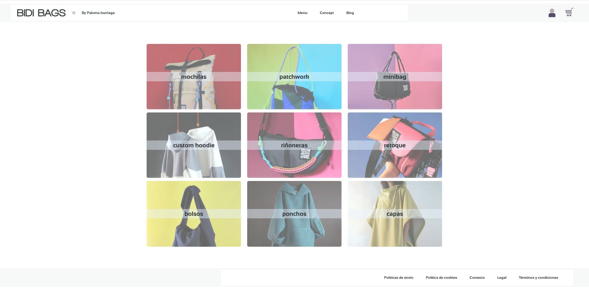

# PROYECTO 13 FINAL - BACKEND TO FRONTEND WITH REACT

# BIDI BAGS

CONCEPTO:

Este proyecto lo he querido enfocar en lo que podría ser la futura tienda online para una diseñadora que fabrica bolsos, mochilas y otros complementos a mano y bajo pequeño stock con colecciones de pocas unidades o bajo demanda.

Su creadora tiene cuenta de Instagram, pero no una web oficial, por lo tanto, está ideada de tal forma que, si se diera el caso, poder usarla para lanzarla.

Como siempre tendrá un stock bastante cambiante y con pocos productos, ya que va variando bastante sus creaciones, decidí exponer las categorías de una forma más visual en la página principal y no mediante selectores. De esta forma, las novedades y el propio diseño de sus fotografías se aprecian en el diseño principal de un primer vistazo.

A futuro, habría cosas que mejorar y añadir, (como por ejemplo añadir galerías y funcionalidades en la gestión tanto del usuario como del administrador), pero esto es un primer boceto con el objetivo de que sea escalable a futuro.

Con un diseño sencillo, visual y minimalista en blanco, negro y escala de grises con la finalidad de que las fotografías coloridas del producto sean la parte destacable. 

---------------------------------------------------------------------------------------

# ENDPOINTS DEL USUARIO

La URL base para todos los endpoints se define en el archivo de configuración como:
const urlApi = "https://bidibagsback-production.up.railway.app";

# GET
- Obtener categorías **URL** ${urlApi}/categories  
- Obtener productos **URL** ${urlApi}/products
- Productos por categoría **URL** ${urlApi}/products/category/categoryName 
- Producto por ID **URL** ${urlApi}/products/id
- Categoría por ID **URL** ${urlApi}/category/id
- Ver Blog **URL** ${urlApi}/latest-post
  

# POST
- Login **URL** ${urlApi}/login
- Registro **URL** ${urlApi}/register

# PUT
Actualizar sus datos de usuario siempre y cuando sea el suyo. Sólo podrá modificarse a sí mismo.

- **URL** ${urlApi}/update-user/id

---------------------------------------------------------------------------------------

# ENDPOINTS DEL ADMIN
Todo lo anterior y además:

# GET
- Traer usuarios **URL** ${urlApi}/users
- Exporar csv con productos **URL** ${urlApi}/products/export/csv
- Exporar csv con categorías **URL** ${urlApi}/categories/export/csv

# POST
- Crear categoría **URL** ${urlApi}/create-category
- Crear producto **URL** ${urlApi}/create-product
- Crear post **URL** ${urlApi}/create-post
  

# PATCH
- Editar / actualizar categoría **URL** ${urlApi}/update-category/id
- Editar / actualizar producto **URL** ${urlApi}/update-product/id

# DELETE
- Borrar usuario **URL** ${urlApi}/delete-user/id
- Borrar producto **URL** ${urlApi}/delete-product/id
- Borrar categoría **URL** ${urlApi}/delete-category/id

---------------------------------------------------------------------------------------

# BACKEND

La estructura de carpetas del backend es la siguiente:

/node_modules
/src
    /api
    /config
    /files
    /middleswares
    /utils
/.env
/.gitignore
/index.js
/myArchive.txt
/package-lock.json
/package.json

# API: 
- controllers:  controladores CRUD del blog, los productos, las categorías y los usuarios. 
- models: los modelos de Mongoose de cada uno.
- routes: las rutas (endpoints) que interactúan con las peticiones a la api.

# CONFIG: 
- db: conexión a la base de datos mediante el método proporcionado por mongoose que contiene el nombre de la variable de entorno (no expuesta) especificada en el archivo .env 
(mongoose.connect(process.env.DB_URL);)

- seed: datos de prueba iniciales.
  

# FILES:
Escritura y lectura de archivos utilizando el módulo fs de node.js. Concierte objetos en una cadena JSON, la escribe en .txt, lee el archivo .txt y muestra el contenido.

# MIDDLEWARES: Procesos antes de que lleguen al controlador o al cliente.
- auth.js: Autenticación y verificación de roles.
- cloudinary.js: Código para almacenar y eliminar imágenes en la nube Cloudinary.

# UTILS: Funciones de soporte.
Creación y verificación de JSON Web Tokens (JWT) para la autenticación y autorización del usuario.

# .ENV:
Almacenaje de información sensible del entorno de ejecución de la aplicación, para facilitar la configuración y proteger datos confidenciales. (variables de entorno).

# GITIGNORE:
Código ignorado para el control de versiones. En este caso, .env y node_modules.

# INDEX.JS:

    1.	Configuración y arranque del servidor Express.
    2.	Conexión con la base de datos MongoDB.
    3.	Configuración para procesar datos entrantes y manejar CORS.
    4.	Configuración para la integración con Cloudinary.
    5.	Rutas principales y manejo de errores, como rutas no encontradas.
    6.	Se establece el servidor en el puerto correspondiente.

# MYARCHIVE.TXT:
Archivo de prueba, para testear la lectura y escritura de archivos con module.fs.

# PACKAGE.JSON:
Dependencias como: bcrypt, body-parser, cloudinary, cors, dotenv, express, fs, jsonwebtoken, 
mongoose, multer, multer-storage-cloudinary, y validator.

---------------------------------------------------------------------------------------

# FRONTEND

La estructura de carpetas del frontend es la siguiente:

/node_modules
/public/assets
    /fonts
    /icons
    /pics
/src
    /admin
    /components
    /pages
    /StyledComponents
    /utils
/App.css
/App.jsx
/index.css
/main.jsx

/.env
/.gitignore
/index.html
/package-lock.json
/package.json
/README.md

# PUBLIC / ASSETS

Algunas fuentes, iconos e imágenes, como por ejemplo los iconos de usuario, foto de la biografía de la diseñadora…etc.

# SRC

- Admin: Funcionalidades específicas para el rol de administrador.
- Components: componentes reutilizables a lo largo de la aplicación.
- Pages: cada página individual de la aplicación.
- StyledComponents: estilos de cada página y componente.
- Utils: contextos, rutas protegidas y uso de la api.

# APP

Este archivo es el componente principal de la aplicación que gestiona la estructura de navegación y las rutas.

- Proveedores de contexto: Utiliza dos proveedores (ApiProvider y AuthProvider) para gestionar el acceso a la API y el estado de autenticación del usuario. Estos contextos permiten que los datos y la funcionalidad estén disponibles en toda la aplicación.

- Animaciones de transición: Controla las animaciones de las rutas, utilizando transition para gestionar las transiciones de las páginas cuando el usuario navega entre ellas.

- Rutas: Se definen varias rutas utilizando react-router-dom:

- Rutas públicas: como las de inicio, blog, y las páginas de categorías.

- Rutas protegidas con el componente ProtectedRoute que asegura que solo los usuarios autenticados (con rol ‘user’) o los administradores (con rol ‘admin’) puedan acceder a ciertos recursos.

- Rutas específicas para la administración de la cuenta (productos, categorías, etc.) y la gestión de la tienda.

Rutas principales: 

- /: Página principal con todas las categorías de productos. /concept, /latest-post, /register, /login, entre otras.
- Rutas protegidas para el usuario (/account) con rutas hijas como shopping-cart, my-data, favorites, etc.
- Rutas protegidas para el administrador (/admin-account) con rutas hijas como products, categories, create-product, etc.
- Header y footer, que se muestran en todas las páginas.

# MAIN.JS: Entrada de la aplicación de React:

- CreateRoot: para inicializar la aplicación en el contenedor con el id root en el archivo index.html.

- StrictMode: envuelve y activa el StrictMode de React, útil durante el desarrollo para detectar problemas y asegurar mejores prácticas.

- Configuración del Router: El archivo envuelve toda la aplicación en el componente BrowserRouter, que proporciona las funcionalidades de enrutamiento en el navegador.

---------------------------------------------------------------------------------------

# ADMIN: ESTRUCTURA DE CARPETAS

/src
    /admin
        /AdminAccount
        /AllMyCategories
        /AllMyProducts
        /BlogEditor
        /CreateCategory
        /CreateProduct
        /NavBarAdminAccount
        /Stock
        /Update

- AdminAccount: redirecciona a la zona de gestión del administrador, verificando primero si el rol es correcto, y renderiza las rutas hijas dentro de Account (Outlet).

- AllMyCategories: Muestra todas las categorías disponibles de la página para su gestión con el componente Card, donde se muestran algunas funcionalidades, como el nombre de la categoría, la visibilidad de la categoría para el usuario y sus estilos. 
También tendremos la opción de editar / eliminar la categoría o descargar un archivo csv con todos los datos.

- AllMyProducts: Muestra todos los productos disponibles de la página para su gestión con el componente Card, mostrando el nombre de la colección a la que pertenecen. Al hacer click, navegamos al producto detallado (CardDetails en la carpeta“components”). Desde aquí, nos puede derivar a la gestión de edición o actualización del producto (UpdateProduct) o su eliminación directa a través del Warning (en la carpeta “components”). También tendremos la opción de descargar un archivo csv con todos los datos de los productos.

- BlogEditor: Desde aquí se genera el post para el blog que contiene la aplicación, usando el componente FormComponent.

- CreateCategory: Desde aquí se crea una nueva categoría desde el gestor, usando el componente FormComponent.

- CreateProduct: Desde aquí se crea un nuevo producto desde el gestor, usando el componente FormComponent.

- NavBarAdminAccount:  La barra de navegación del admin en la página de gestión, donde redirige a las rutas sin recargar la página.

- Stock: página en construcción.

- Update:  nos trae el producto o la categoría y nos permite actualizarlos desde aquí.

---------------------------------------------------------------------------------------

# COMPONENTS: ESTRUCTURA DE CARPETAS

/src
    /components
        /Banner
        /Button
        /Error
        /Footer
        /FormComponent
        /FormUpdateuser
        /Header
        /Loading
        /Message
        /NavBars
        /ProductCards
        /Warning

- Banner:  Banner creado, pero no habilitado aún.

- Button: Botón reutilizable y usado en varias secciones de la aplicación, como en los formularios de login, registro o en las acciones de añadir al carrito, por ejemplo. Permite su personalización a través de props para adaptarse a diferentes necesidades, como estilos, texto y acciones específicas.

- Error: componente de aviso de error.

- Footer: Diseño del footer.

- FormComponent: Componente de formulario reutilizable y flexible, que se adapta dinámicamente a los campos que recibe. Dependiendo de los datos proporcionados, como el tipo de campo (input, textarea, checkbox, file), se renderiza adecuadamente. Maneja datos iniciales y realiza validaciones básicas. Incluye una vista previa de imágenes para campos de tipo file. Su diseño y estilo son completamente personalizables, permitiendo ajustarlo según el uso en diferentes partes de la aplicación, como formularios de login, registro o actualización de productos.

- FormUpdateUser: Componente de formulario reutilizable y flexible que permite la gestión de datos de usuario, incluyendo campos anidados. Basado en el componente anterior, es ideal para formularios más complejos que requieren subcampos (como un formulario con secciones o categorías de datos). 

- Header: estructura y diseño del encabezado.

- Loading: componente de búsqueda.

- Message: componente de mensaje de aviso con texto dinámico.

- Navbars: Barras de navegación de toda la aplicación y sus estilos (styledComponnets).

- ProductCards: tarjetas del producto o de las categorías con sus diferentes estilos (styledComponents) según su uso a lo largo de la aplicación.
Desde CardDetails se realizan varias funcionalidades despendiendo de si el usuario es admin o user.

- Warning: Componente de advertencia en toma de decisiones en la aplicación (por ejemplo: “quieres borrar el producto?”).

---------------------------------------------------------------------------------------

# PAGES: ESTRUCTURA DE CARPETAS

/src
    /pages
        /Account
        /Blog
        /FooterPages
        /Login
        /LoginRegister
        /MyChanges
        /MyData
        /MyFavorites
        /MyOrderStatus
        /MyPaymentMethods
        /SearchBy
        /ShoppingCart
        /SignOut
        /TheDesign

- Account:  Página del usuario.
- Blog: Diseño del blog donde se muestra siempre el último post.
- FooterPages: Todas las páginas y diseño del footer.
- Login: Manejo del login.
- Login / Register: Manejo del registro. Redirige al Login si existe cuenta.
- myChanges: Se refiere a cambios y devoluciones. Aún en construcción.
- myData: Muestra los datos del usuario y desde aquí da la opción de editarlos para actualizarlos.
- myFavorites: Muestra los favoritos de usuario en su cuenta.
- myOrderStatus y myPaymentMethods: Aún en construcción.
- searchBy: 
    /AllCategories: Muestra las categorías de la página principal (main).
    /ByCategory: Muestra los productos que hay de cada categoría cuando se hace click en una categoría de la página principal.
    /ById: Muestra el producto detallado al usuarioy desde aquí se puede añadir a favoritos o al carrito.

- ShoppingCart: Página del carrito donde se calcula el monto total.
- SignOut: cerrar sesión.
- TheDesign: página donde se habla de la diseñadora. (Concept)

---------------------------------------------------------------------------------------

# STYLED COMPONENTS: ESTRUCTURA DE CARPETAS

/src
    /StyledComponents
        /StyledBlogAdmin
        /StyledblogEditor
        /StyledBlogPage
        /StyledCategoryCards
        /StyledFooterPages
        /StyledLoginRegister
        /StyledMainCategories
        /StyledMyAccountPages
        /StyledNavBars
        /StyledProductCards
        /StyledProductPages
        /StyledTheDesignPage
        /StyledUserAccount

Páginas donde están la mayor parte de estilos de páginas y componentes de la página. Las referencias siempre a las rutas styledComponents.

---------------------------------------------------------------------------------------

# UTILS: ESTRUCTURA DE CARPETAS

/src
    /utils
        /ApiContext
        /AuthContext
        /ProtectedRoute
        /useApi
        /useReducer

- ApiContext: contexto para usar la apiUrl en cada lugar.

- AuthContext y AuthProvider:

AuthProvider maneja la autenticación y gestión del estado del usuario a lo largo de la aplicación. Utiliza React Context para proporcionar información sobre el usuario, token de autenticación y métodos asociados a la autenticación a lo largo de la aplicación.

FUNCIONES PRINCIPALES:

1.	login(userData, authToken): maneja el inicio de sesión del usuario. Recibe los datos del usuario y el token de autenticación, los guarda en el estado local y los almacena en localStorage para mantener la sesión persistente.

2.  logout(): Este método cierra la sesión del usuario, limpia el estado local y elimina los datos del usuario y token almacenados en localStorage.

3.	updateUser(newUserData): Actualiza los datos del usuario en el servidor. Realiza una petición PUT al backend con los nuevos datos del usuario y actualiza el estado del usuario y localStorage con la respuesta.

4.	toggleFavorite(product): Permite añadir o eliminar un producto de la lista de favoritos del usuario. Se verifica si el producto ya es un favorito y se actualiza la lista en el backend. La información de favoritos se sincroniza con el estado y localStorage.

5.	toggleCart(product): Permite añadir o eliminar un producto del carrito del usuario. Similar a toggleFavorite, se verifica si el producto ya está en el carrito y se actualiza la lista de productos en el backend. Los cambios se reflejan en el estado y localStorage.

PERSISTENCIA DE SESIÓN:

-	useEffect: En el AuthProvider, al cargar la aplicación, se intenta obtener el usuario y el token desde el localStorage para mantener la sesión del usuario activa si ya estaban guardados anteriormente.

ESTADO GLOBAL:

-	user: Información del usuario actualmente autenticado.
-	token: El token de autenticación asociado al usuario.
-	login, logout, updateUser, toggleFavorite, toggleCart: Métodos expuestos a través de Context para ser utilizados en cualquier componente hijo que consuma este contexto.

USO DEL CONTEXT:

- AuthContext: Se utiliza el contexto AuthContext a través del hook useAuth() para acceder a los datos de autenticación y los métodos en cualquier parte de la aplicación.

- ProtectedRoute: protege ciertas rutas de la aplicación; solo los usuarios autenticados y con un rol específico pueden acceder a ellas. Si el usuario no está autenticado o no tiene el rol necesario, será redirigido a una página diferente.

- useApi / useReducer:
El hook useApi permite realizar peticiones HTTP a la API y gestionar los datos de la respuesta mediante un reducer de estado. Además, gestiona la caché local (usando localStorage) para evitar realizar peticiones innecesarias, mejorando el rendimiento de la aplicación.

Está diseñado para que los cambios realizados por el administrador se reflejen inmediatamente para el usuario, siendo útil para mantener datos actualizados en tiempo real, especialmente cuando el administrador realiza modificaciones en el sistema.

const cachedData = user && user.rol !== 'admin' ? JSON.parse(localStorage.getItem(cacheKey)) : null;

Antes de realizar una petición, verifica si los datos de la misma solicitud ya están guardados en localStorage como parte de un sistema de caché.
Si los datos están en caché, los utiliza directamente para actualizar el estado de la aplicación y evitar la petición HTTP.

El useApi hace uso de un reducer para manejar el estado de la respuesta de la API, como la lista de productos, el usuario autenticado, posts, etc.
El reducer gestiona tres acciones principales: FETCH_INIT (inicio de la petición), FETCH_SUCCESS (respuesta exitosa) y FETCH_FAILURE (error en la petición).

---------------------------------------------------------------------------------------

# LIBRERÍAS DE ESTILOS

He optado por no utilizar Chakra UI ya que he preferido tener un control más personalizado sobre los estilos. Sin embargo, he considerado la integración de Styled Components y Framer Motion por sus ventajas específicas.

Styled Components lo elegí principalmente por su comodidad y eficiencia. Al permitir la creación de componentes estilizados dentro del propio archivo JS, facilita la reutilización de estilos comunes en diferentes partes de la aplicación, reduciendo la redundancia y favoreciendo la gestión centralizada de los estilos.

Framer Motion, por su simplicidad en la implementación de animaciones. Su integración directa en los componentes optimiza tanto la legibilidad del código como la flexibilidad para realizar ajustes a los estilos y animaciones según sea necesario.

---------------------------------------------------------------------------------------

# RUTAS PROTEGIDAS

Un usuario no puede acceder a la barra de navegación de gestión del administrador dentro de la aplicación.
Ni siquiera cambiando los roles desde el inspector del navegador, ya que las rutas de administrador están protegidas con un estado de autenticación (AuthContext), el cual se comparte a lo largo de toda la aplicación.

---------------------------------------------------------------------------------------

